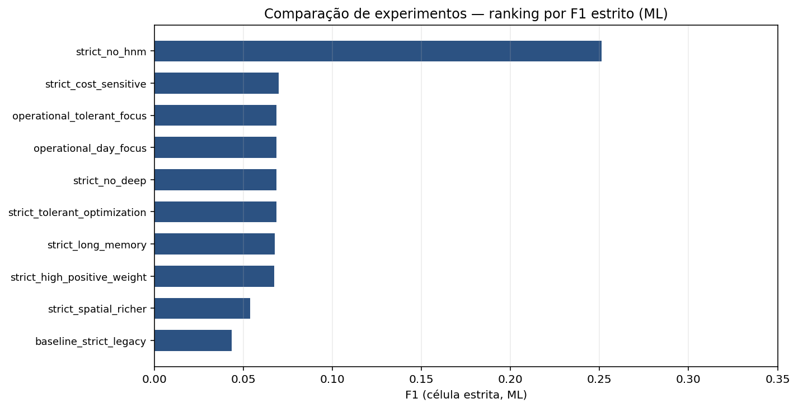
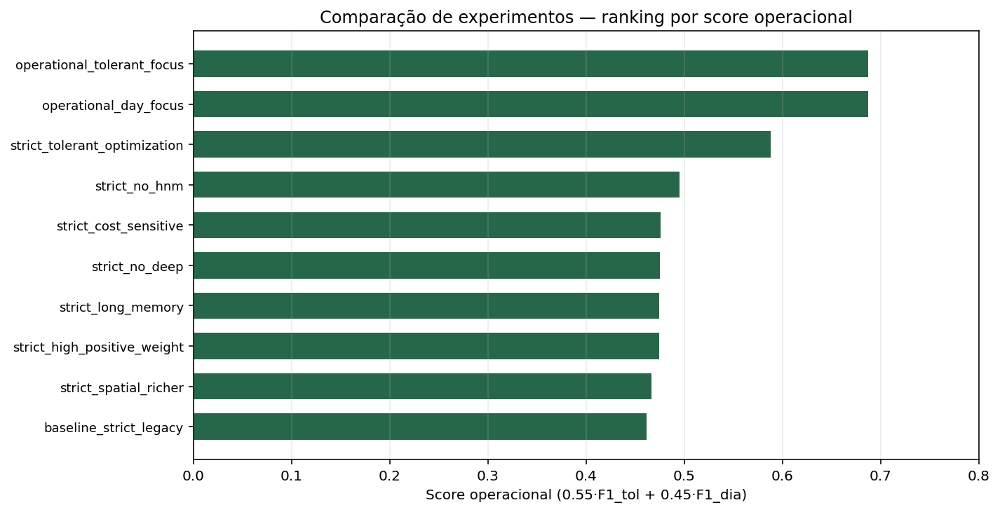
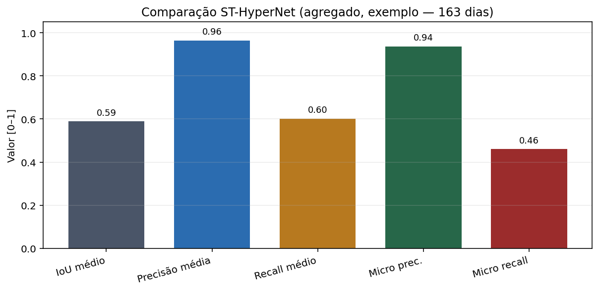
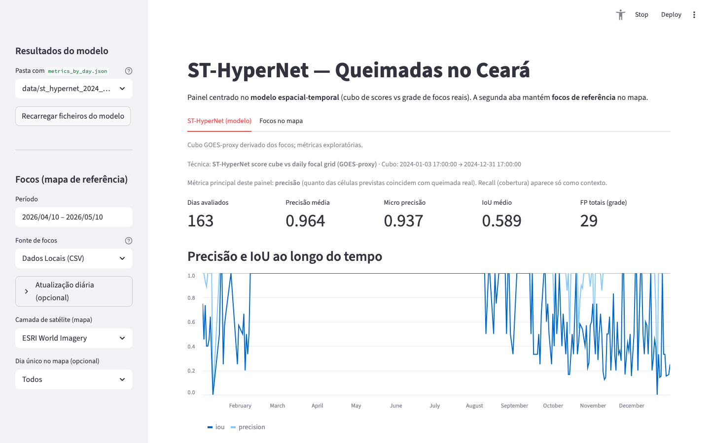
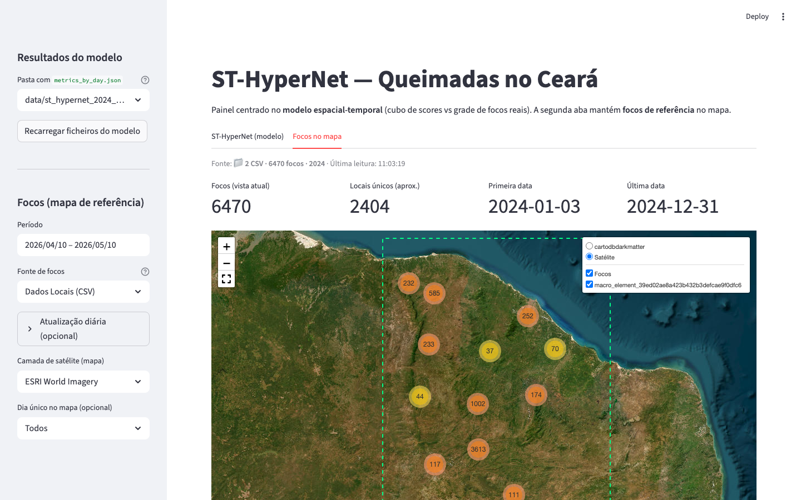
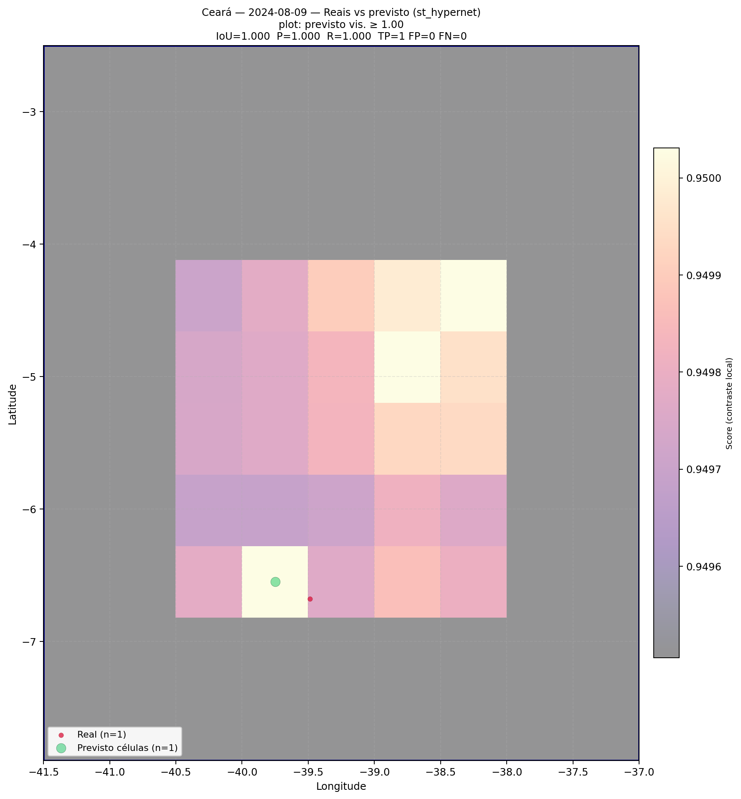
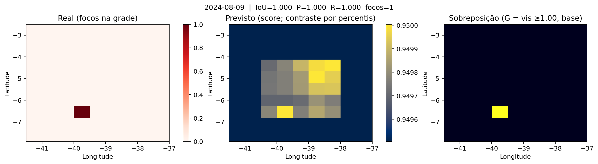

# Digital Twin para Detecção de Queimadas no Ceará

**Proposta Funcional** — Monitoramento e predição de queimadas usando dados abertos de satélite e gêmeos digitais.

## Objetivo

Construir um gêmeo digital (digital twin) do estado do Ceará para:
- **Detectar** focos de queimadas em tempo real via satélites (INPE/NASA FIRMS)
- **Simular** a propagação do fogo baseado em condições ambientais
- **Visualizar** em um dashboard interativo 2D/3D
- **Validar** o modelo comparando predições com observações reais

## Como o modelo funciona (em poucas palavras)

1. **Entrada**: os focos de queimada abertos (por exemplo INPE) são organizados numa **grelha** sobre o Ceará e ao longo do **tempo** — como um mapa de calor dividido em quadrados e dias.
2. **Gêmeo digital**: o programa simula como o fogo poderia **espalhar-se** de quadrado para quadrado, com regras simples inspiradas em risco e no que já aconteceu antes.
3. **Aprendizado de máquinas (ML, opcional)**: outro módulo procura **padrões** nos dias anteriores em cada quadrado e tenta dizer se é provável haver fogo no dia seguinte; os limiares são ajustados com dados reais para equilibrar acertos e alarmes falsos.
4. **ST-HyperNet e GOES não supervisionado (opcionais, em experimentos)**: montam um “filme” simplificado de sinais semelhantes aos de satélite a partir dos próprios focos; o sistema aprende o que seria **normal** em cada lugar e hora e realça onde o comportamento **foge ao normal** — útil para explorar anomalias, não para substituir o produto oficial de detecção.

Isto é **apoio à análise** com dados públicos. Para o detalhe técnico e referências, veja [ARTICLE.md](ARTICLE.md).

## Artigos (English)

- Versão técnica completa: [ARTICLE.md](ARTICLE.md)
- Versão acadêmica (paper style): [ARTICLE_ACADEMIC.md](ARTICLE_ACADEMIC.md)

## Documentação Técnica

- Comparação de técnicas e ranking de experimentos: [EXPERIMENTS.md](EXPERIMENTS.md)
- Protocolo reproduzível de experimentos: [EXPERIMENT_PROTOCOL.md](EXPERIMENT_PROTOCOL.md)
- Proposta PYRO-Caatinga (MVP implementado): [PYRO_CAATINGA.md](PYRO_CAATINGA.md)
- Guia de artefatos e melhores parâmetros: [GUIA_EXPERIMENTOS_E_PARAMETROS.md](GUIA_EXPERIMENTOS_E_PARAMETROS.md)
- **Como montar o README** (experimentos, imagens, checklist): [INSTRUCOES_README.md](INSTRUCOES_README.md)
- **Capturas de ecrã do dashboard** (README + script Playwright): [docs/INSTRUCOES_CAPTURAS_DASHBOARD.md](docs/INSTRUCOES_CAPTURAS_DASHBOARD.md)
- Explicação automática por dia (DeepSeek, opcional): [docs/AGENTE_EXPLICACAO_CASOS.md](docs/AGENTE_EXPLICACAO_CASOS.md)

## Dados Abertos Utilizados

| Dado | Fonte | Acesso |
|------|-------|--------|
| Focos de calor (MODIS/VIIRS) | INPE BDQueimadas | bdqueimadas.dpi.inpe.br |
| Imagens multiespectrais | ESA Copernicus Sentinel-2 | scihub.copernicus.eu |
| Meteorologia | FUNCEME / ERA5 | funceme.br |
| Vegetação/Cobertura | MapBiomas | mapbiomas.org |
| Topografia (SRTM) | USGS | earthexplorer.usgs.gov |
| Limites municipais | IBGE | ibge.gov.br |

## Estrutura do Projeto

```
digital-twin-queimadas-ceara/
├── README.md              ← Esta proposta
├── requirements.txt       ← Dependências Python
├── config/
│   └── ceara_config.py    ← Configurações do Ceará (municípios, áreas críticas)
├── data/
│   └── (dados baixados aqui - gitignored)
├── src/
│   ├── fire_data.py       ← Download e parsing de focos de calor
│   ├── digital_twin.py    ← Motor do gêmeo digital (predição de propagação)
│   └── analysis.py        ← Análise temporal e estatística
├── notebooks/
│   └── proposta_funcional.ipynb  ← Notebook principal com demo
├── dashboard/
│   └── app.py             ← Dashboard interativo (Streamlit)
├── docs/
│   ├── fixtures/          ← CSV/JSON de exemplo para figuras do README
│   ├── INSTRUCOES_CAPTURAS_DASHBOARD.md
│   └── screenshots/     ← PNGs (dashboard, mapas, experimentos)
└── scripts/
    ├── capture_dashboard_screenshots.py      ← Capturas do Streamlit (Playwright)
    ├── copy_sample_st_map_pngs_to_docs.py    ← Mapas ST a partir de data/
    └── generate_readme_experiment_figures.py ← Gráficos ML + ST para o README
```

## Como Executar

```bash
# Instalar dependências
pip install -r requirements.txt

# Pipeline principal (fonte padrão INPE)
python main.py

# Pipeline usando GOES-16 e validação ML
python main.py --api goes16 --ml-validate --ml-mode operational

# Pipeline com CSV local real
python main.py --local data/focos_CE_GOES16_2024.csv --ml-validate --ml-mode strict_cell

# Rodar bateria de experimentos e salvar comparação
python -m src.run_experiments --dataset data/focos_CE_GOES16_2024.csv --output-dir data/experiments

# Rodar MVP PYRO-Caatinga
python main.py --pyro-mvp --pyro-goes-csv data/focos_CE_GOES16_2024.csv --pyro-output-dir data/pyro_caatinga --pyro-max-days 7

# Executar dashboard
streamlit run dashboard/app.py

# Executar notebook
jupyter notebook notebooks/proposta_funcional.ipynb
```

## Funcionalidades Implementadas

- [x] Download automático de focos de calor do INPE para o Ceará
- [x] Ingestão GOES-16 com fallback (CSV/KML) e atualização diária incremental
- [x] Integração NASA FIRMS e fusão INPE+FIRMS
- [x] Mapeamento de focos por município e bioma
- [x] Modelo simplificado de propagação de fogo (algoritmo de cell automaton)
- [x] Dashboard Streamlit centrado em **ST-HyperNet** (métricas, mapa reconstruído, GOES INPE) + aba de focos no mapa
- [x] Análise temporal (sazonalidade, tendência anual)
- [x] Validação ML + gêmeo digital com split temporal e comparação com dados reais
- [x] Benchmark de múltiplas técnicas (árvores, MLP, logística, ensemble)
- [x] Geração automática de artefatos de experimento (CSV/JSON/Markdown)
- [x] MVP da proposta PYRO-Caatinga (climatologia residual + destilação + loop twin)

## Artefatos Gerados

Execução principal:
- data/pipeline_result.json
- data/ml_twin_validation.json
- data/twin_state_latest.json

Execução de experimentos:
- data/experiments/all_experiments_summary.csv
- data/experiments/all_experiments_full.json
- data/experiments/runs/*.json

Execução PYRO-Caatinga MVP:
- data/pyro_caatinga/pyro_goes_proxy_cube.nc
- data/pyro_caatinga/pyro_residual_cube.nc
- data/pyro_caatinga/pyro_viirs_soft_labels.npy
- data/pyro_caatinga/pyro_twin_pseudo_labels.npy
- data/pyro_caatinga/pyro_frp_proxy.npy
- data/pyro_caatinga/pyro_caatinga_report.json

## Figuras — experimentos ML e comparação ST-HyperNet

Os gráficos abaixo vêm de **`docs/fixtures/`** (amostras versionadas) e são gerados para `docs/screenshots/` por:

`python scripts/generate_readme_experiment_figures.py`

Opcionalmente use o CSV real da sua máquina: `--experiments-csv data/experiments/all_experiments_summary.csv` e `--st-aggregate-json data/st_hypernet_2024_all_fire_days/metrics_aggregate.json`. Detalhes: [docs/INSTRUCOES_CAPTURAS_DASHBOARD.md](docs/INSTRUCOES_CAPTURAS_DASHBOARD.md).

### Bateria `run_experiments` — ranking de técnicas





Ranking textual completo: [EXPERIMENTS.md](EXPERIMENTS.md).

### Comparação ST-HyperNet (métricas agregadas — exemplo 2024)



## Dashboard (Streamlit)

Comando: `streamlit run dashboard/app.py` (na raiz do repositório).

- **Aba ST-HyperNet (modelo):** escolha a pasta com `metrics_by_day.json`, veja agregados, gráfico de precisão/IoU, seleccione um dia, figuras **real vs previsto** e **mapa reconstruído** (fundo satélite + focos GOES INPE quando a rede responde).
- **Aba Focos no mapa:** período, fonte de dados (CSV local recomendado para teste rápido) e mapa de referência.

Instruções para **gerar ou actualizar** as imagens abaixo: [docs/INSTRUCOES_CAPTURAS_DASHBOARD.md](docs/INSTRUCOES_CAPTURAS_DASHBOARD.md) (inclui script `scripts/capture_dashboard_screenshots.py` com Playwright).

### Capturas de ecrã (interface)





### Mapas do Ceará com achados (exemplo ST-HyperNet)

As pastas sob `data/` não entram no git; os exemplos abaixo estão em **`docs/screenshots/`** (copiados da saída de `compare_st_hypernet_days` — focos **reais** vs células **previstas** e legenda de métricas). Para actualizar depois de uma nova corrida:

`python scripts/copy_sample_st_map_pngs_to_docs.py --date YYYY-MM-DD`

**Mapa geográfico (reais vs previsto no Ceará)** — dia de exemplo 2024-08-09:



**Grade binária (real vs previsto)** — mesmo dia:



## Próximos Passos

1. Substituir o cubo proxy do PYRO-Caatinga por ingestão direta de bandas ABI/GLM
2. Integrar mascaramento de nuvens para melhorar destilação VIIRS->GOES
3. Incorporar vento (ERA5/Open-Meteo) no laço de feedback do twin
4. Publicar painel de comparação de experimentos dentro do dashboard
